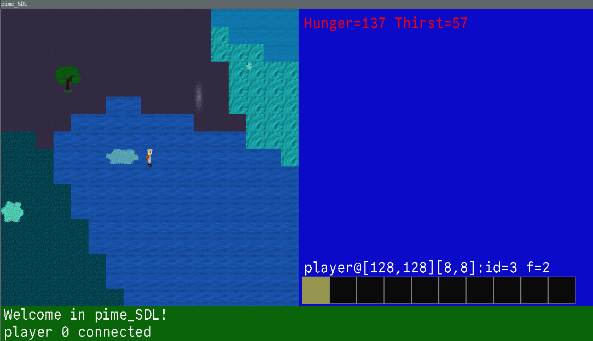
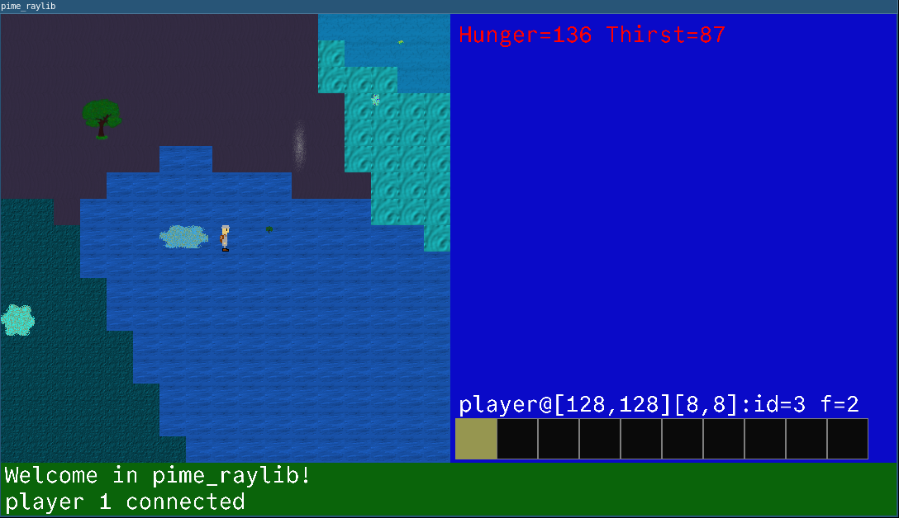

# The Game aka pime aka alchemist

This game is currently under development using
* C++
* [SDL2](https://www.libsdl.org)
* [Raylib](https://github.com/raysan5/raylib.git)
* [Godot](https://github.com/godotengine/godot.git)




## Dependencies installation

* [Installation instruction](install.md)

## Compilation configuration

* Set variables in config.txt

## Build

```
./build.sh
```

## Run

* Server

```
./run_server.sh
```

* SDL client

```
./run_local_sdl.sh
```

* Raylib client

```
./run_local_raylib.sh
```

## This project uses

* https://github.com/ryanoasis/nerd-fonts

