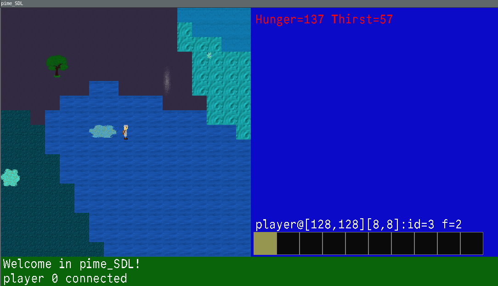
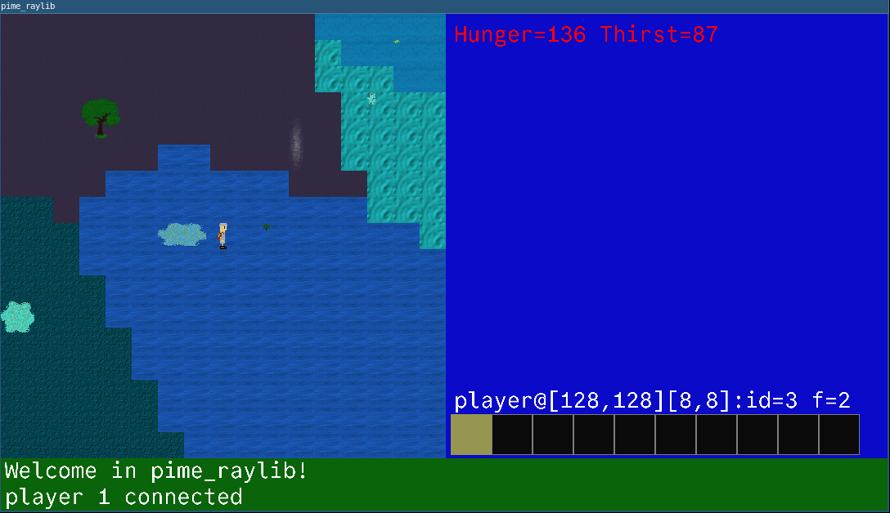

# The Game aka pime aka alchemist

This game is currently under development using
* C++
* [SDL2/SDL3](https://www.libsdl.org)
* [Raylib](https://www.raylib.com/)
* [Godot](https://godotengine.org)
* [OpenGL](https://www.opengl.org)




## Dependencies installation

* [Installation instruction](install.md)

## Compilation configuration

* Set variables in config.txt

## Build

```
./rebuild.sh
```

## Run

* Server

```
./run_server.sh
```

* SDL client

```
./run_local_sdl.sh
```

* Raylib client

```
./run_local_raylib.sh
```

* OGL client

```
./run_local_ogl.sh
```


## This project uses

* https://github.com/ryanoasis/nerd-fonts

